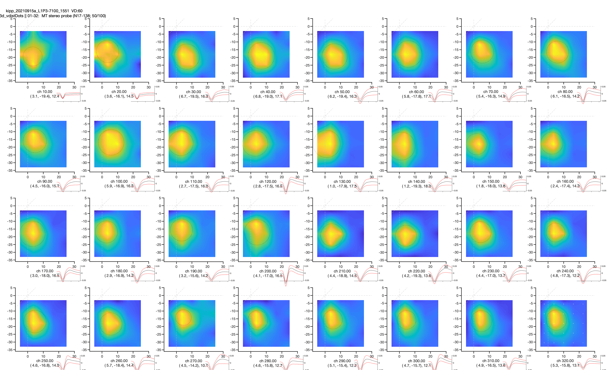

# spk

Ephys spike loading &amp; analysis tools (Matlab, PLDAPS, Plexon, Kilosort...)

- Analysis functions currently coded for somewhat specific set of MT tuning assessments, but should serve as straightforward example for more generalized use


## Dependencies

- Loading .PDS data files requires a current version of the **[PLDAPS (glDraw branch)](https://github.com/czuba/PLDAPS.git)** in the Matlab path.
  _(...without this, custom data classes, like the `condMatrix`, cannot be loaded properly)_


- All you should need in your path for these analyses to work is PLDAPS and this SPK repo


## Code walkthrough example

- `./analysis/exampleAnalysis.m` contains a [relatively] commented & cleaned-up walkthrough of an ephys experiment analysis


## Working example

- For a working version of the code the walkthrough was based on...

  - start with Matlab in a PLDAPS session directory

    - e.g.  `/Data/<yyyymmdd>/` , containing a standard set of  `./eye`, `./pds`, & `./spk` sub-directories

  - execute `tt = scanSesh` to retrieve info about the available PLDAPS experiment files within that session

    - this _should_ 'just work' (or fail gracefully) for most PLDAPS experiments utilizing a `condMatrix` design

    - example `tt` = 

      ```matlab
      idx      subj           plx              loc         pdsTime            exptName            viewDist    nPasses    nTrials    durMin
      ___    ________    _____________    _____________    ________    _______________________    ________    _______    _______    ______
       1     {'kipp'}    {'20210915x'}    {'L1P3-6500'}    {'1430'}    {'doXzTune_quik1'     }       60         17         163      37.714
       2     {'kipp'}    {'20210915a'}    {'L1P3-7100'}    {'1548'}    {'doRfPos3d_vdistDots'}       60          2          14      1.8908
       3     {'kipp'}    {'20210915a'}    {'L1P3-7100'}    {'1551'}    {'doRfPos3d_vdistDots'}       60          7          66      5.0414
       4     {'kipp'}    {'20210915b'}    {'L1P3-7100'}    {'1602'}    {'do3dTune_dotBall'   }      101         67        1226      110.59
       5     {'kipp'}    {'20210915b'}    {'L1P3-7100'}    {'1754'}    {'doRfPos3d_vdistDots'}       60          1          20      2.8501
       6     {'kipp'}    {'20210915b'}    {'L1P3-7100'}    {'1757'}    {'doRfPos3d_vdistDots'}       60          8         431      28.941
      ```

  - any single experiment in a given session can usually be fully specified by it's `pdsTime` string

    - e.g. **`'1551'`**

    - find a file corresponding to an RF position measurement (`exptName` likely starting with "`doRfPos3d...`")

      ```matlab
      ... pdsTime            exptName          ...
      ... ________    _______________________  ...
      ... {'1551'}    {'doRfPos3d_vdistDots'}  ...
      ```

  - run the `rfPosAwake3d.m` analysis function to generate receptive field [RF] plots & create the corresponding  **"dv struct"** standard output:
    `dv = rfPosAwake3d('1551', [666,1])`        _(...see `help rfPosAwake3d` for details)_
    
    


---


**Development & Attribution**

Unless otherwise stated, all code written & developed by:
Thaddeus B. Czuba, 200x-2022
https://visualstimul.us

